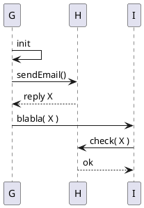

You can clarify, communicate or specify the responsibilities of
building blocks by using scenarios.

By visualizing scenarios or processes you can create common understanding
of building blocks within teams.

Use lightweight tools - i.e. paper or text-based tools. With full-scale modeling
tools you can achieve visually aesthetic results - for the price of higher
creation of maintenance effort.

### Example: Render sequence diagrams with PlantUML

[PlantUML](https://plantuml.com/) is a free tool that can render sequence diagrams from a textual description.

Consider an example: In the following listing you find the description of a simple sequence, shown in the figure below:

{:width="30%"}

Charming: Such textual descriptions can be merged and versioned like any other source code!

PlantUML supports most UML SD constructs, like interaction references, loops, alternatives and so on. You can apply _some_ styles to diagrams and export in several graphic formats (png, jpg, svg). There are numerous plugins available for wikis, development environments, build tools or the command line.

> From my (Gernot) experience, PlantUML is very developer-friendly and therefore well-suited for discussing scenario alternatives among the development team.
