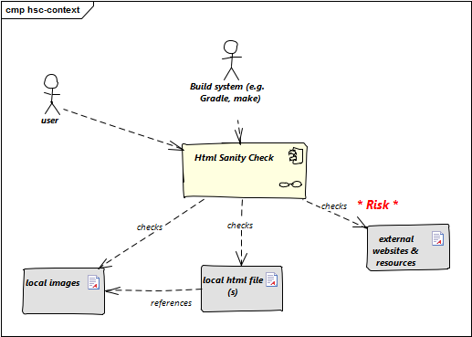

 
This is a very simple example, created with Enterprise Architect(TM).

## 3. Context View

|Neighbor  |Description |
|------|:-----|
|user         |documents software with toolchain that generates html. Wants to ensure that links within this HTML are valid.     |
|-----|---------|
|build system      |mostly <a target="_blank" rel="noopener noreferrer nofollow" href="https://gradle.org">Gradle</a>               |
|------|---------|
|local HTML files  |HtmlSC reads and parses local HTML files and performs sanity checks within those.                                |
|------|---------|
|local image files |HtmlSC checks if linked images exist as (local) files.     |
|------|---------|
|external web resources |HtmlSC can be configured to optionally check for the existence of external web resources. 
**Risk**: Due to the nature of web systems and the involved remote network operations, this check might need significant time and might yield invalid results due to network and latency issues.  |
