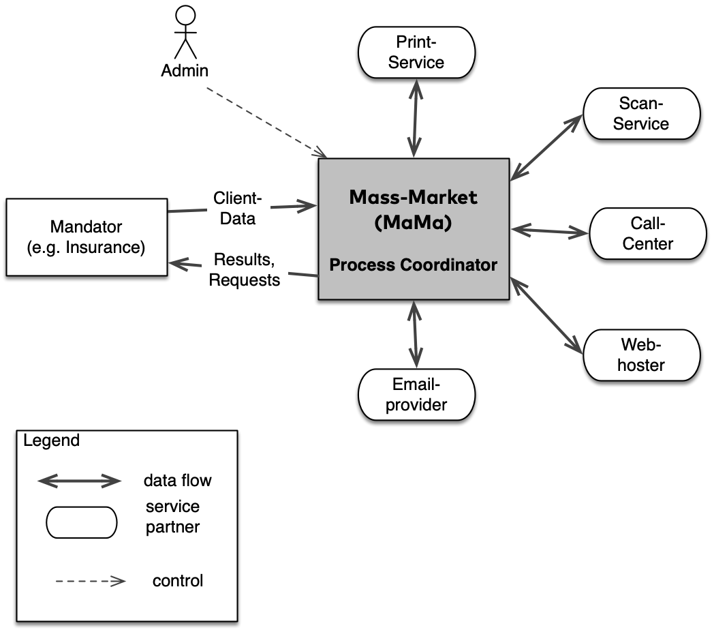

 
A simple diagram with a brief explanation in a table.

## 3. Context View

### 3.1 Business Context 

|Element         | Description |
|------|:------|
| MaMa   | our system, (system-under-design)|
| Mandator | the organizatino which provides MaMa with client + address data, and pays for its service |
| PrintService | company printing letters on MaMas' behalf. Takes either pdf, PostScript or AFP as input format |
| ... | ...|
|-
