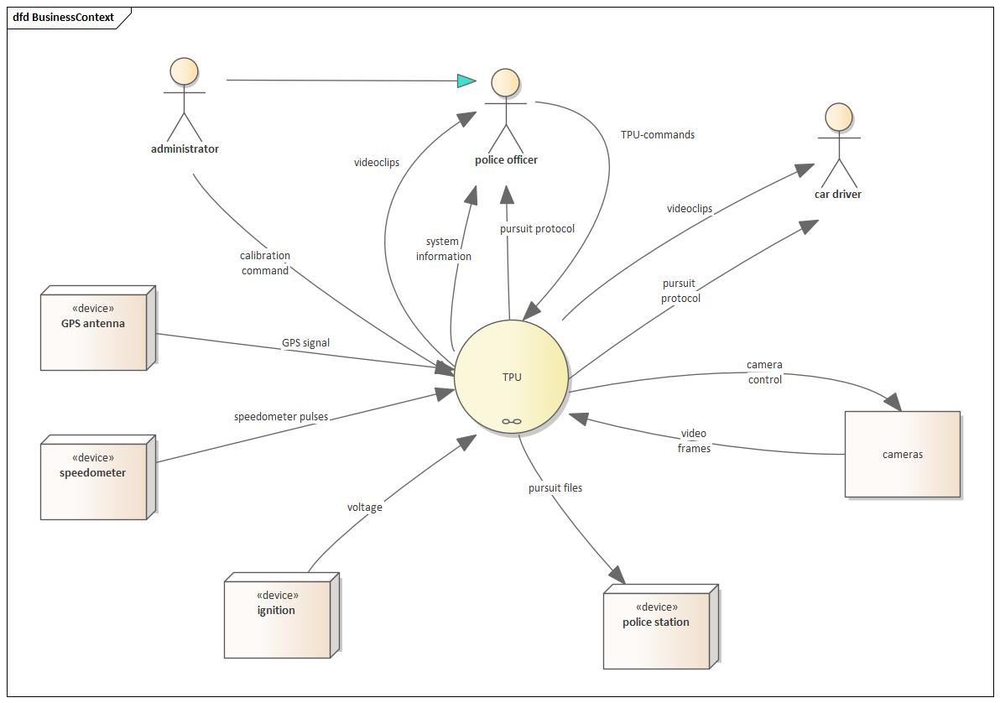

 
This example has been created with Enterprise Architect(TM) as a data flow diagram.

## 3. Business Context View
The following figure shows the major inputs and outputs of the traffic pursuit unit - the human users as well as the technical environment (sensors,cameras, ...)

