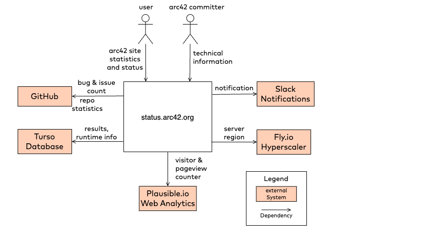

 
This example has been created with drawio/diagrams.net.

## 3. Business Context View
The following figure shows the major inputs and outputs of the [status.arc42.org](https://status.arc42.org) website.

