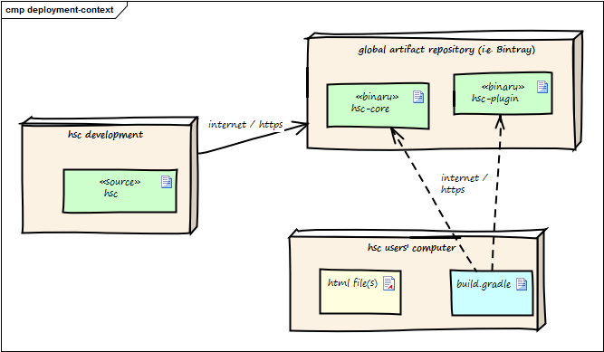

 
This is a very simple example, created with Enterprise Architect(TM).

## 3. Context View

### 3.2 Technical Context

The following diagram shows the participating computers (nodes) with their technical connections plus the major artifacts of HtmlSC, the hsc-plugin-binary.

|Node / Artifact   |Description                                           |
|------|--------|
|hsc-development   |where development of HtmlSC takes place               |
|------|--------|
|hsc-plugin-binary |compiled and packaged version of HtmlSC including required dependencies.|
|------|--------|
|artifact repository | A global public _cloud_ repository for binary artifacts, similar to [MavenCentral](https://search.maven.org/), the [Gradle Plugin Portal](https://plugins.gradle.com) or similar. HtmlSC binaries are uploaded to this server.          |
|------|--------|
|hsc user computer |where arbitrary documentation takes place with html as output formats.|
|------|--------|
|build.gradle      |Gradle build script configuring (among other things) the HtmlSC plugin to perform the HTML checking.  |
|------|--------|

For details see the deployment-view.
