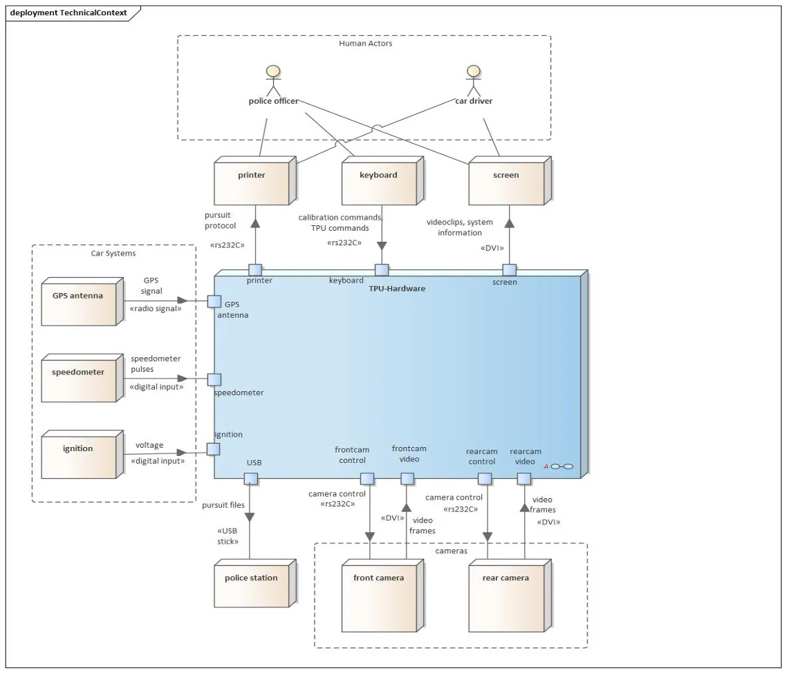

 
This example has been created with Enterprise Architect(TM) as a deployment model. 

## 3.2 Technical Context View
The technical context diagram shows the channels linked to the TPU-hardware (as UML stereotypes in <<...>>). The mapping of the logical input and output is shown as annotations on the channel to adjacent systems.

