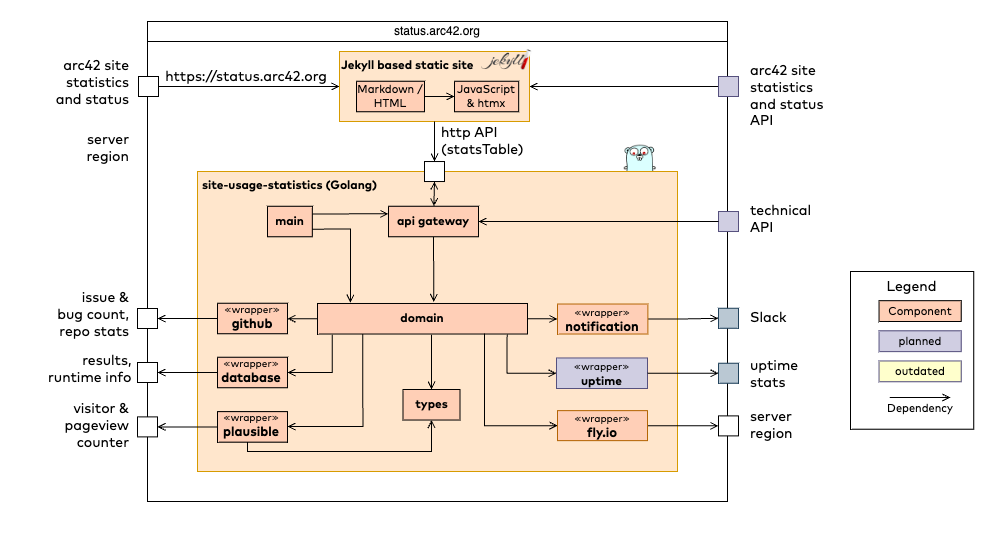

 
This example contains the simple building block view of our [status-site](https://status.arc42.org).

### 5.1 Whitebox status.arc42.org

**Contained Blackboxes:**

(left our for brevity)

|Building block | Description    |
|-------|:------|
| | |
|-------|------|
| | |
|-------|------|
