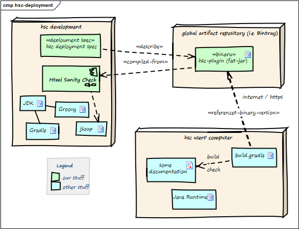

## 7. Deployment View

|Node / Artifact    | Description                                                |
|-------------------|------------------------------------------------------------|
|hsc plugin binary  |Compiled version of HtmlSC, including required dependencies.|
|-------------------|------------------------------------------------------------|
|hsc-development    |Development environment                                     |
|-------------------|------------------------------------------------------------|
|artifact repository|Global public _cloud_ repository for binary artifacts, similar to [mavenCentral](https://mvnrepository.com/) HtmlSC binaries are uploaded to this server.   |
|-------------------|------------------------------------------------------------|
|hsc user computer  |Where documentation is created and compiled to HTML.      |
|-------------------|------------------------------------------------------------|
|build.gradle       |Gradle build script configuring (among other things) the HtmlSC plugin. |
|-------------------|------------------------------------------------------------|

The three nodes (_computers_) shown in the diagram above are connected via Internet.

**Prerequisites**:

* HtmlSC developers need a Java development kit, Groovy, Gradle plus the JSoup
HTML parser.
* HtmlSC users need a Java runtime (> 1.6) plus a build file named `build.gradle`.
(within this documentation example we omitted the listing of the build script).
