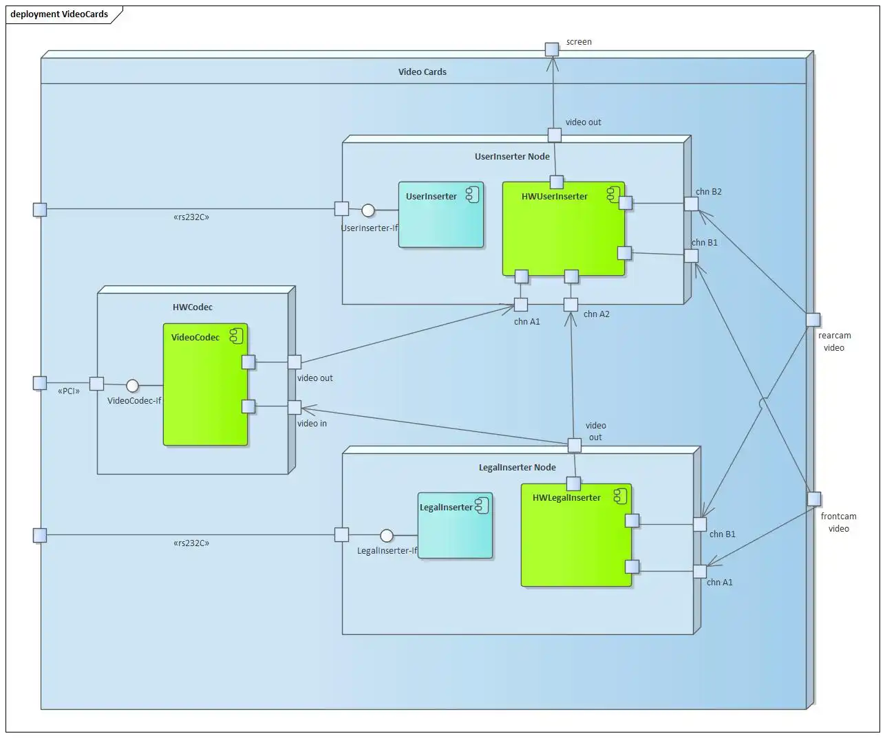
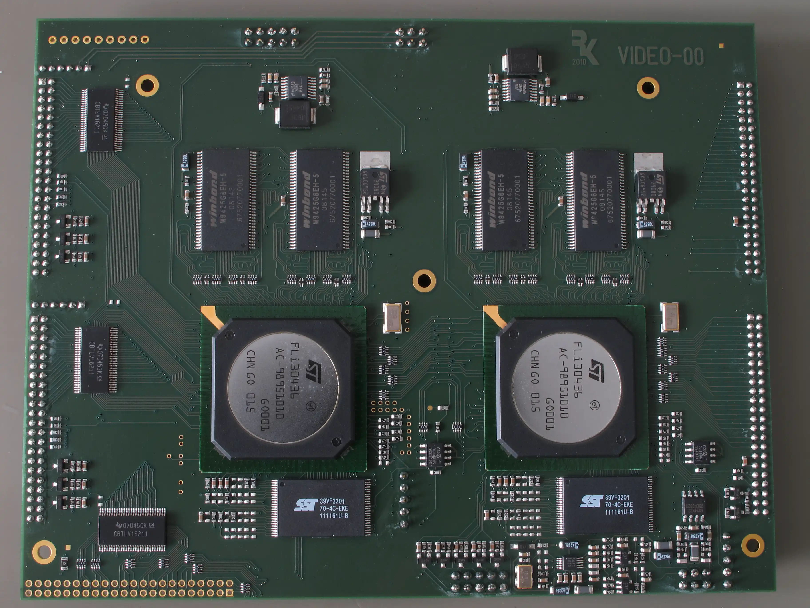
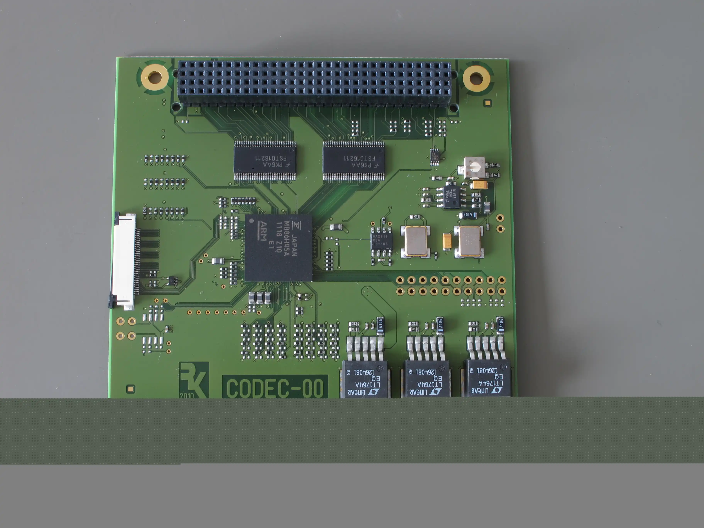

 
The example shows an Enterprise Architect (TM) deployment diagram to show the refinement of one processors.

## 7.2 Deployment View Level 2 (VideoCards)

### Video Cards (Details)

 

The video cards consists of two PCBs: one PCB contains two video inserters (UserInserter Node and LegalInserter Node, cf. figure 7.5 and the other one contains the Codec.

 

