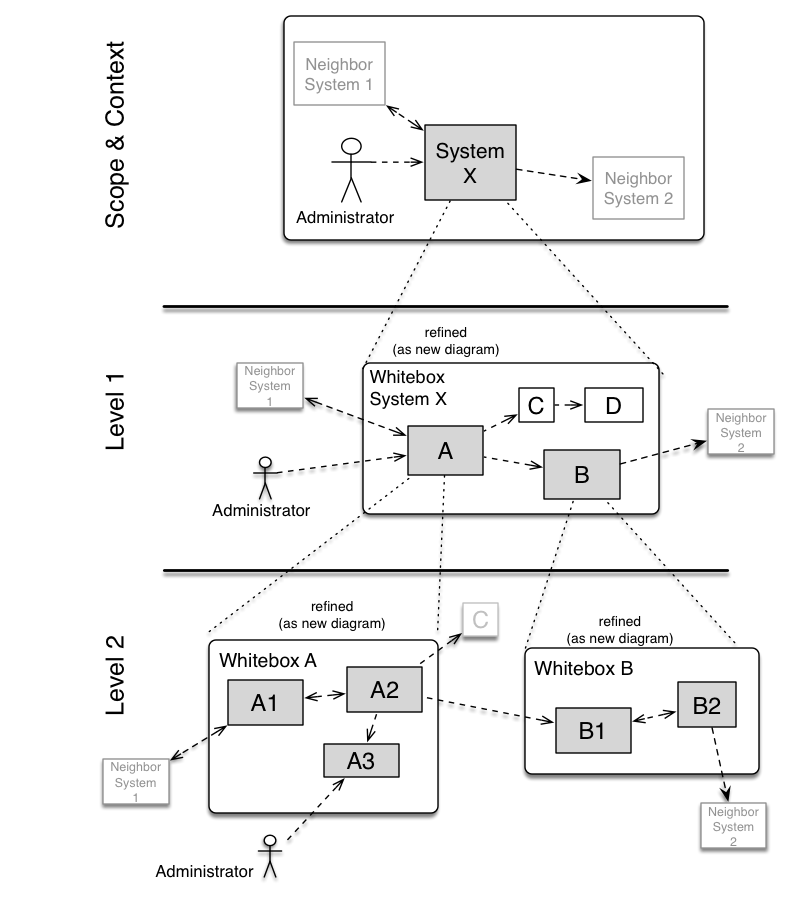

# 5. Building Block View

> [!arc42-help]
>
> ## Content
> The building block view shows the static decomposition of the system into building blocks (modules, components, subsystems, classes,
> interfaces, packages, libraries, frameworks, layers, partitions, tiers, functions, macros, operations,
> data structures, ...) as well as their dependencies (relationships, associations, ...)
>
> This view is mandatory for every architecture documentation.
> In analogy to a house this is the _floor plan_.
>
> ## Motivation
> Maintain an overview of your source code by making its structure understandable through abstraction.
>
> This allows you to communicate with your stakeholder on an abstract level without disclosing implementation details.
>
> ## Form
> The building block view is a hierarchial collection of black boxes and white boxes (see figure below) and their descriptions.
>
> 
>
> * **Level 1** is the white box description of the overall system together with black box descriptions of all contained building blocks.
> * **Level 2** zooms into some building blocks of level 1.
> Thus it contains the white box description of selected building blocks of level 1, together with black box descriptions of their internal building blocks.
> * **Level 3** (not shown in the diagram above) zooms into details of selected building blocks of level 2, and so on.
>
> <!-- collect all examples that are related to this section of arc42 -->
> %% examples: building-block %%
>

<!-- the same section, inside complete documentation of real systems -->
%% examples-link %%

## 5.1 Whitebox Overall System

> [!arc42-help]
> Here you describe the decomposition of the overall system using the following **white box template**.
> It contains
>
> * an overview diagram
> * a motivation for the decomposition
> * black box descriptions of the contained building blocks. For these we offer you alternatives:
>   * use _one_ table for a short and pragmatic overview of all contained building blocks and their interfaces
>   * use a list of black box descriptions of the building blocks according to the black box template (see below). Depending on your choice of tool this list could be sub-chapters (in text files), sub-pages (in a Wiki) or nested elements (in a modelling tool).
>
> * (optional:) important interfaces, that are not explained in the black box templates of a building block, but are very important for understanding the white box.
>
> Since there are so many ways to specify interfaces why do not provide a specific template for them.
>
> In the best case you will get away with examples or simple
> signatures.
>

### _&lt;insert overview diagram of overall system>_

### _&lt;describe motivation/reasoning for overall system decomposition>_

### _&lt;describe contained building blocks (blackboxes)>_

### _&lt;(optionally) describe important interfaces>_

> [!arc42-help]
>
> Insert your explanations of black boxes from level 1:
>
> If you use tabular form you will only describe your black
> boxes with name and  responsibility according to the following schema:
>
> | **Name** | **Responsibility** |
> |----------|--------------------|
> | _&lt;black box 1>_ | _&lt;Text>_ |
> | _&lt;black box 2>_ | _&lt;Text>_ |
>
> Its headline is the name of the black box.
> If you use a list of black box descriptions then you fill in a separate black box template for every important building block.
>
> Sometimes it can be useful to amend the table with additional columns:
>
> **Name** | **Responsibility** | **Interfaces** | **Code**
> |----------|--------------------|------|-----|
> | _&lt;black box 1>_ | _&lt;Text>_ | What are the major interfaces of this block? | Where is the code located?
> | _&lt;black box 2>_ | _&lt;Text>_ | ---"--- | ---"---
>
>

### _&lt;Name Blackbox 1>_

> [!arc42-help]
>
> Here you describe <black box 1>
> according the the following **black box template**:
>
> * Purpose/Responsibility
> * Interface(s), when they are not extracted as separate paragraphs. This interfaces may include qualities and performance characteristics.
> * (Optional) Quality-/Performance characteristics of the black box, e.g.availability, run time behavior, ....
> * (Optional) directory/file location
> * (Optional) Fulfilled requirements (if you need traceability to requirements).
> * (Optional) Open issues/problems/risks
>
> You can use a table or text.

_&lt;Purpose/Responsibility>_

_&lt;Interface(s)>_

_&lt;(Optional) Quality/Performance Characteristics>_

_&lt;(Optional) Directory/File Location>_

_&lt;(Optional) Fulfilled Requirements>_

_&lt;(optional) Open Issues/Problems/Risks>_

### &lt;Name black box 2>

_&lt;black box template>_

### &lt;Name black box n>

_&lt;black box template>_

### &lt;Name interface 1>

...

### &lt;Name interface m>

## 5.2 Level 2

> [!arc42-help]
> Here you can specify the inner structure of (some) building blocks from level 1 as white boxes.
>
> You have to decide which building blocks of your system are important enough to justify such a detailed description. Please prefer relevance over completeness. Specify important, surprising, risky, complex or volatile building blocks. Leave out normal, simple, boring or standardized parts of your system
>

### 5.2.1 White Box _&lt;building block 1&gt;_
> [!arc42-help]
> Specifies the internal structure of _building block 1_.
>
> Use the white box template (see above).

_< insert white box template of building block 1 >_

### 5.2.2 White Box _&lt;building block 2&gt;_
_< insert white box template for building block 2 >_

...

### 5.2.n White Box _&lt;building block n&gt;_
_< insert white box template for building block n >_

## 5.3 Level 3

> [!arc42-help]
> Here you can specify the inner structure of (some) building blocks from level 2 as white boxes.
>
> When you need more detailed levels of your architecture please copy this
> part of arc42 for additional levels.

### 5.3.1 White Box _&lt;building block x.1&gt;_

> [!arc42-help]
> Specifies the internal structure of _building block x.1_.

_< insert white box template of building block x.1 >_

### 5.3.2 White Box _&lt;building block x.2&gt;_
_< insert white box template of building block x.2 >_

### 5.3.3 White Box _&lt;building block y.1&gt;_
_< insert white box template of building block y.1 >_
