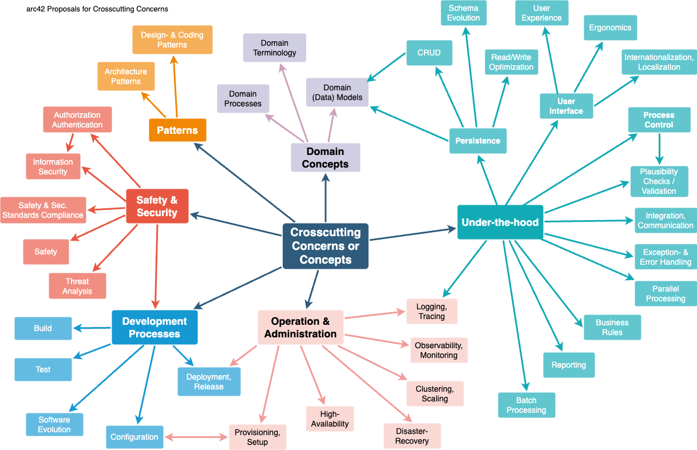

# 8. Crosscutting Concepts

> [!arc42-help]
>
> ## Content
> This section describes crosscutting concepts (practices, patterns, regulations or solution ideas).
> Such concepts are often related to multiple building blocks. 
> They may include many different topics, such as the topics shown in the following diagram:
>
> 
>
> ## Motivation
> Concepts form the basis for _conceptual integrity_ (consistency, homogeneity) of the architecture. 
> Thus, they are an important contribution to achieve inner qualities of your system.
>
> This is the place in the template that we provided for a cohesive specification of such concepts.
>
> Many of these concepts relate to or influence several of your building blocks. 
>
> ## Form
> The form can be varied:
>
> * concept papers with any kind of structure
> * example implementations,especially for technical concepts
> * cross-cutting model excerpts or scenarios using notations of the architecture views
>
>
> ## Structure of this section
> Pick **only** the most-needed topics for your system and assign each a level-2 heading in this section (e.g. 8.1, 8.2 etc).
>
> >DO NOT ATTEMPT to cover all of the topics of the aforementioned diagram.
>
> ## Background
> Some topics within systems often concern multiple building blocks, hardware elements or development processes.
> It might be easier to communicate or document such _cross-cutting_ topics at a central location, instead of repeating them in the description of the concerned building blocks, hardware elements or development processes.
>
> Certain concepts might concern **all** elements of a system, others might only be relevant for a few.
> In the diagram above, logging concerns all three components, whereas security is relevant only for two components.
>
>
> Some real-life examples:
>
> * Within a system, a common format for log-messages shall be established, combined with a common convention of choosing the appropriate log-destination.
> These decisions, along with implementation examples, could be described as "logging-concept".
> * A system has numerous backend services, that communicate among each other based upon remote procedure calls or https-based REST.
>    * Calling services ("consumers") always need to authenticate themselves to the called service ("provider").
>    * For this authentication, a central common authorization service has to be used.
>    * The technical and organizational details such authentication could be described as "backend authentication concept". 
> * (taken from the HTML Sanity Checker, see below): 
> All (7+) checker components within the system are structured according to the strategy pattern.
>
>
>
> <!-- collect all examples that are related to this section of arc42 -->
> <!-- ================================================================-->
> %% examples: concepts %%
>

<!-- the same section, inside complete documentation of real systems -->
%% examples-link %%

_&lt;describe concepts here >_
