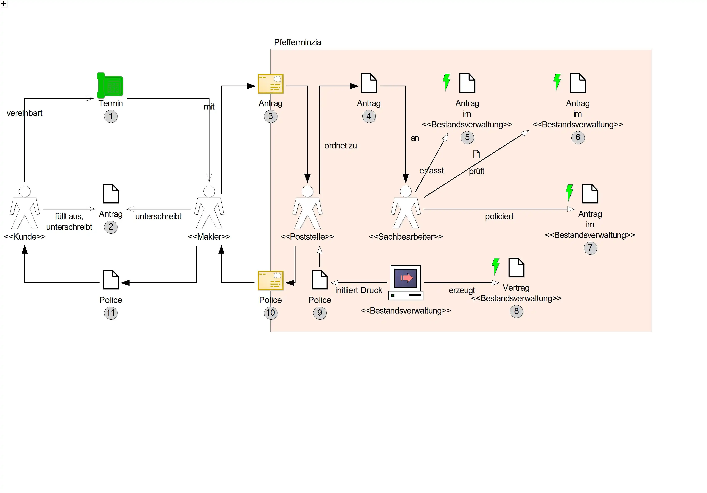

You can describe functional requiremens as "exemplary business process model".
They describe processes from the viewpoint of stakeholder and the tools
and materials used.

Please consider the following example:

