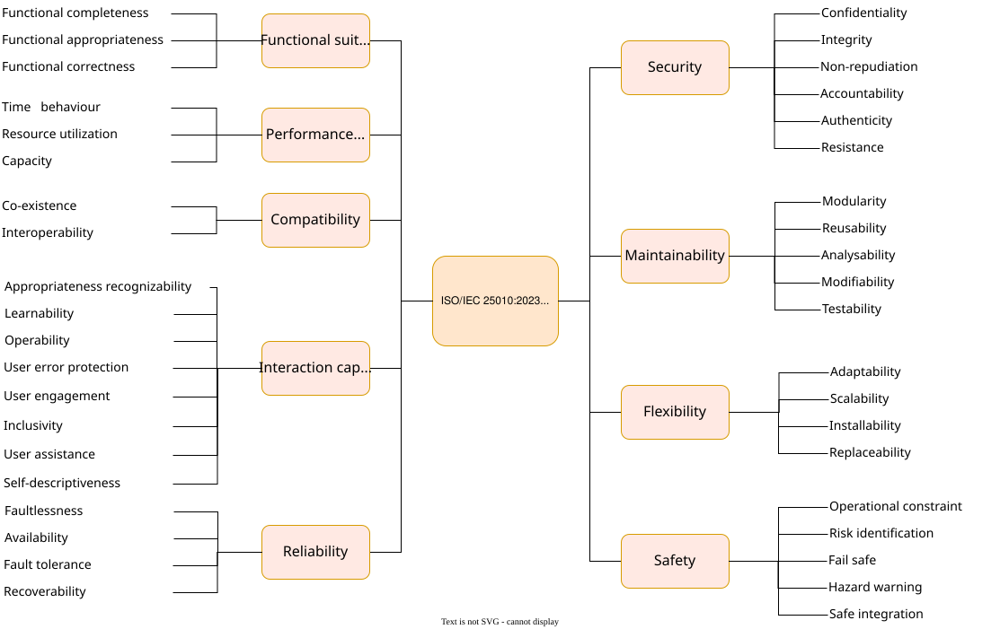

With its hierarchical representation (see the diagram below),
the ISO standard 25010:2023 provides a good checklist for top-level quality "topics".

As a more practical alternative, consider the arc42 subproject "quality requirements examples" ([see tip 1-15](/tips/1-15/)) for around 150 real-world examples of
quality requirements.

Some common "quality topics" are:

* availability
* modifiability
* maintainability
* reliability / robustness
* performance (runtime efficiency)
* security
* safety
* usability
* testability
