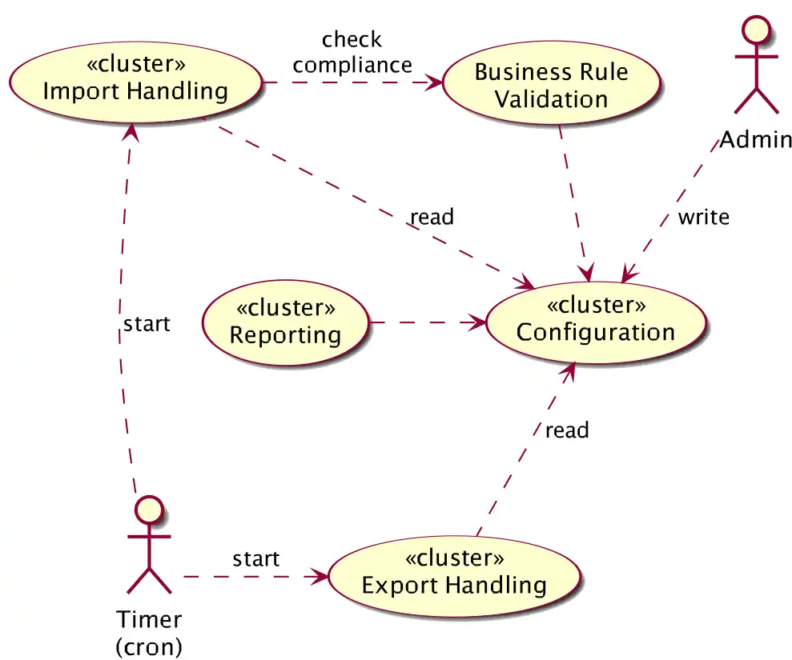

Group or cluster similar use cases, user stories, procedures, functions,
processes, tasks, or other functional requirements.

In order to provide an overview of the functions of your system, describe in your
architecture documentation only the importance of these groups without going into
detailed individual requirements.

The figure below shows an example: some ellipses group (cluster) multiple
requirements, features or use cases. Some of them can be found in the table.

{:width="70%"}

|Requirements cluster                  |Description                                     |
|--------------------------------|------------------------------------------------|
| Import Handling                |Import-from-Mandator, Import-von-PrintShop, Import-from-Scanner, Import-from-CallCenter, Import-from-CAMS, ...  |
| Configuration                  |Configure-Person, Configure-PrintJob, Configure-ScanOCR, Configure-Reports, ... |
|--------------------------------|------------------------------------------------|
