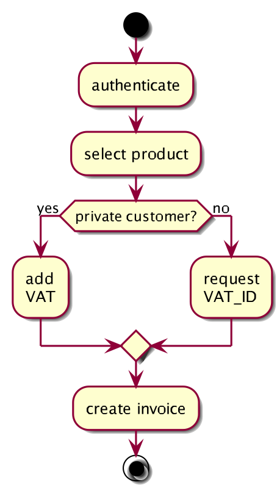

Activity diagrams can do two things for you: give a good visual overview of activities
and also explain the handling of special cases, alternatives, parallelisms or sequences.
Potential drawback is the relatively high cost of creation and maintenance.

{:width="40%"}
