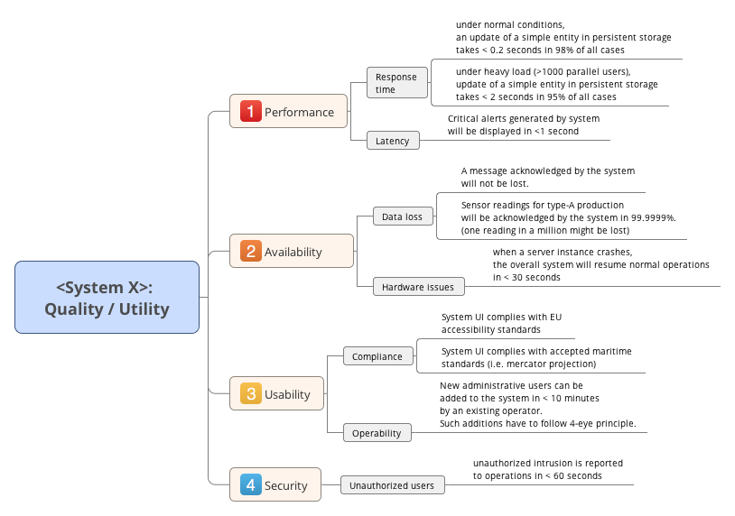

>In previous versions of this tip, we proposed a graphical quality tree.
>Now, a few years later, we favor a simple table instead of the graphics.
>
>A discussion of our reasons lies beyond the scope of this documentation.
>In short: Our own pragmatical quality model [Q42](https://quality.arc42.org) makes use of tags/labels instead of a strict hierarchy.
>That proved to be a major improvement over the graphics.

We propose to keep arc42 section 1.2 (quality goals) short, there you show only the top 3-5 quality goals, with priorities.

Here, in arc42 section 10, we go into more detail:

* Show your most important quality goals and -requirements (if you're a mindmap- or graphics fan, use a graphical version)

>In software engineering literature, e.g. from the Software Engineering Institute, such tree-structures have been named _Quality Attribute Utility Tree_. 
They are integral part of the <a target="_blank" rel="noopener noreferrer nofollow" href="https://www.sei.cmu.edu/architecture/tools/evaluate/atam.cfm">ATAM</a> architecture analysis and evaluation method, which many people consider overly formal and slow.

Such a tree _can_ provide a good overview of required qualities, it can document focus points. 
If it grows larger, all overview gets lost - and a simple table will win.

#### Further references

* Arnon Rotem-Gal-Oz has written up a <a target="_blank" rel="noopener noreferrer nofollow" href="https://arnon.me/2010/05/utility-trees-hatching-quality-attributes/">more detailed explanation of the quality tree</a>.

* The pragmatic quality model, [quality.arc42.org](https://quality.arc42.org)
