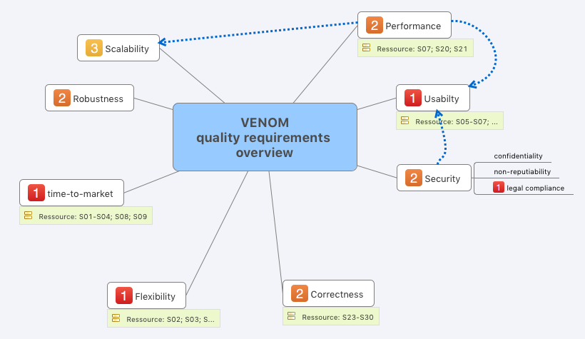

You find a slightly different notion in [tip 1-14 (checklist for quality requirements)](/tips/1-14/).

Use the clarity of a graphical quality tree (or mind-map) to identify potential gaps in
the quality requirements:

Discuss quality goals and requirements with your decisive stakeholders, preferably in a
joint workshop.

1. Start with something similar to the ISO 25010:2023 quality tree.

2. Let your stakeholders create quality scenarios
3. Attach those scenarios to a specific quality tree
4. In case some of the major branches of your tree have no scenarios, that might be an indicator
for missing scenarios. In the diagram below, neither scalability, robustness nor security have scenarios.
5. Let your stakeholders decide wether these topics are not relevant or if the corresponding scenarios
are just missing or have been forgotten.

