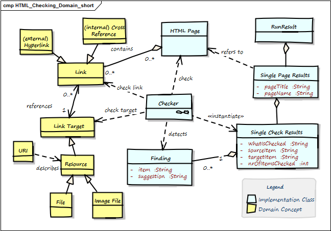

You might explain the relationships of important terms in a diagram,
and use that diagram as a basis for textual explanation or definition.

You find an example below (taken from the open-source project "HtmlSanityCheck"):

(in the example we skipped the table with proper definitions - we're quite sure
you can imagine how it should look like...)
