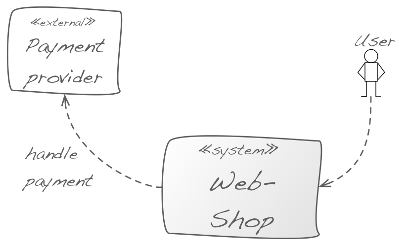

Define "what's inside" your system and what's outside.

You should demarcate your system from other IT systems in order to show how it
fits into the existing IT environment, which external interfaces are offered or consumed
and what users or roles are using the system.

That way you show the scope of your system: what are the responsibilities
of your system and what are the responsibilities of its neighbor systems.

You find an example in the diagram below: It shows the context of a webshop which delegates the payment handling to an external provider (removing this
responsibility from the scope of the webshop).

{:width="70%"}
