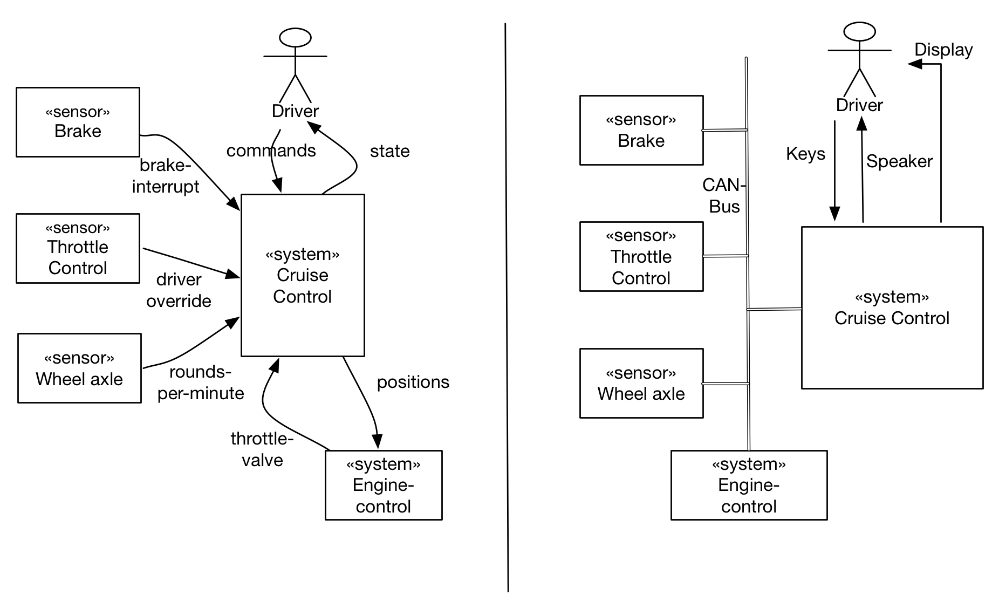
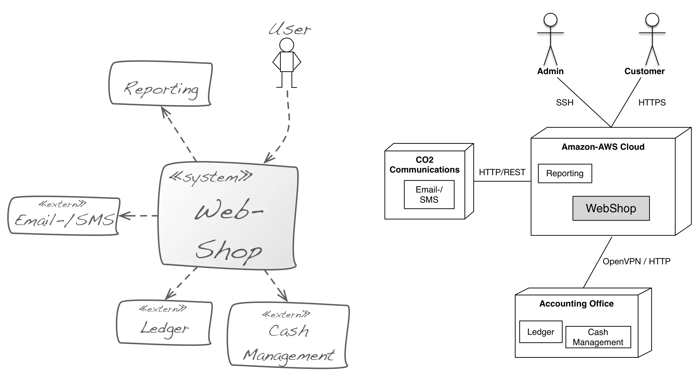

Especially with information systems, you can often ignore technical details
of the infrastructure within the context and focus on domain- or business
related aspects.

However, if hardware or technology plays an important role for your system,
you need both a business (domain) as well as a **technical context**.

### Example from embedded system (automotive)
In the figure below you can find a simplified example from the
embedded world: the left part shows the business (domain) context, the right
part depicts the technical context.

### Example of web-based system
The figure below shows a small example of a (web-based) information system
with business and technical context.

You recognize protocols such as HTTPS or SSH within the technical context,
which are intentionally not mentioned in the domain context.

Further, the (from a domain point of view external) component "Reporting" is
deployed in the same technical infrastructure as the main system.

