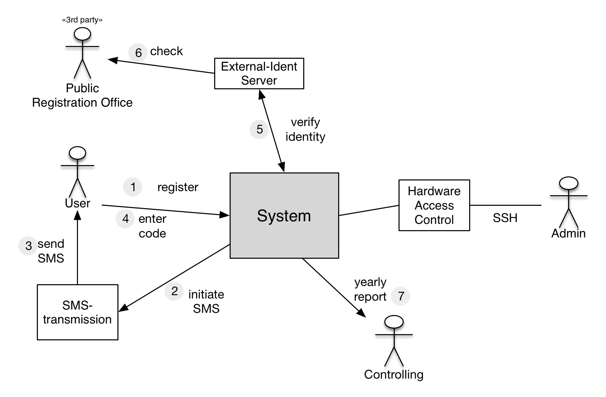

Systems have sometimes indirect (transitive) dependencies that may be relevant
for communication with some stakeholders. Include those dependencies in your
context. An example is shown in the figure below: The dependencies 3 and 6 as
well as the registry office in the upper left corner are indirect.

Caution: transitive dependencies in the context contradict the rule of
economicalness (as you get additionel elements by showing transitive dependencies).
Therefore you should only describe them if it is necessary for understanding the
actual situation.

