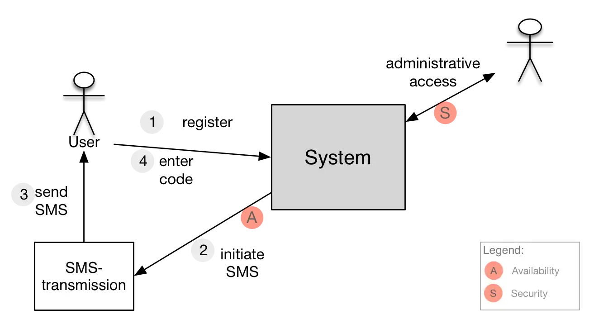

Special quality requirements may apply to interfaces of your own system and
maybe as well to your external systems, e.g. safety, throughput or availability
requirements. These so-called "service levels" need to be treated with care,
because they may have high implementation and operating expenses and -risks.

You could denote special quality requirements or -goals in your context diagram.

In the example below, you find two markers at external interfaces
that indicate that the corresponding interfaces influence these Q-goals.

## See also

* ([tip 3-4 (risk in context)](/tips/3-4))
