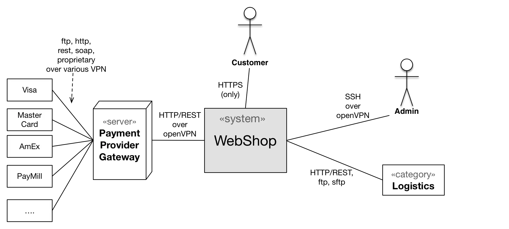

Even in a typical business context (like in the diagram below), it might be
helpful to include certain technical details, like transmission-protocolls,
VPN (virtual-private-network), or even server/hardware information.

Typically we suggest to separate business- from such technical information,
but a combination might save some documentation effort

