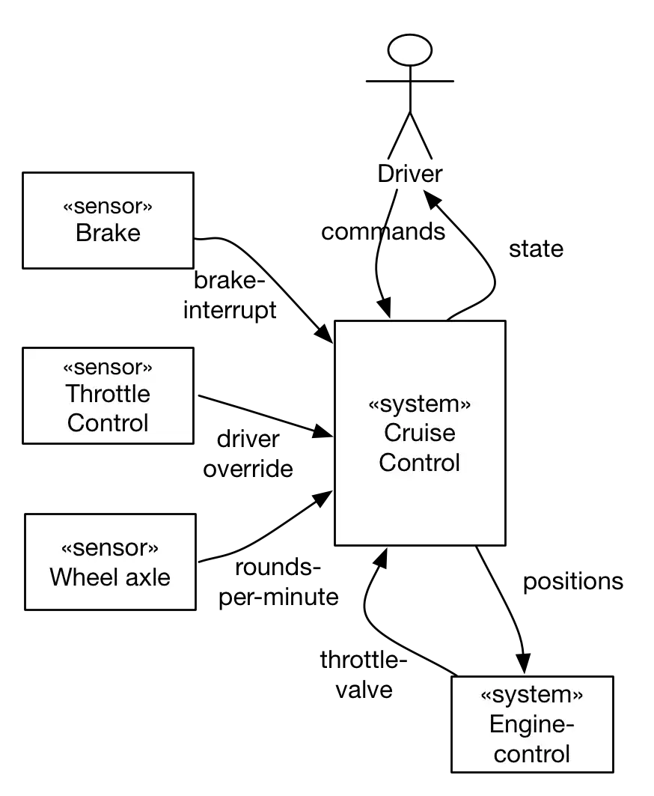

In case your domain interfaces are realized in the technical
infrastructure through different technical channels, protocols or
interfaces, you should explicitely describe the mapping between
those two _areas_.

A simple example of such a situation can be found in the diagram below.
The relationships (mapping) can easily be described with a table:

| Domain interface        | Technical implementation |  
|-------------------------|---------------------|
| brake interrupt, driver override, rounds per-minute, throttle valve, positions         | CAN bus             |
| User commands          | Switches, keys, levers in cockpit     |
| Status information      | Audio output, display in cockpit  |

