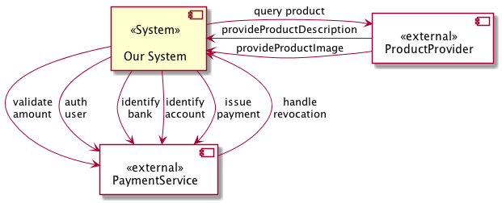

### Document all external interfaces

You should document **all** external interfaces or neighbours, although
_categorization_ or abstraction is a valid option. 

### Refrain from overly detailed interface descriptions here

See the following counter-example - which contains too many details for
a context _real_ context diagram:

