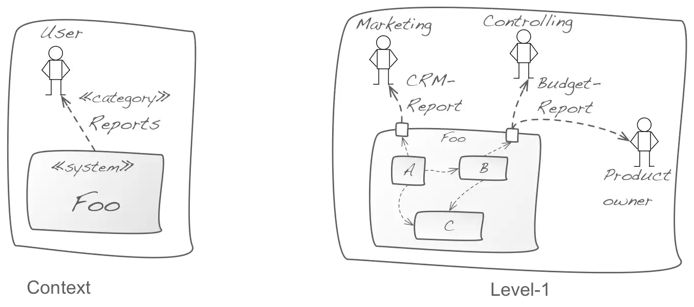

Keep the context small and simple: categorize external interfaces, systems or
user roles that have strong similarities. Explicitly show that they are
categories or abstractions.

See the following example - where the context contains only a single "report" interface,
(a "category"), that is broken down into two different types of reports on level-1.

I've seen context diagrams with way more than 50 (!) external neighbours, in which
case categorization is an awesome way to reduce visual clutter and make diagrams
understandable again...
