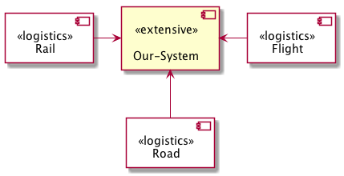
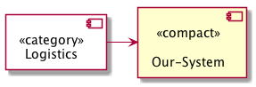

If your system interacts with many external systems, you can combine several of
these external systems by explicit criteria. You should explicitly state these
criteria. Such criteria may include systems:

* share common or similar data
* communicate within the same use case or at the same time
* communicate using identical or similar technologies (e.g. categorized by ftp- and WebService)
* belong to the same or similar organization, such as: all systems of garages, insurances, glass manufacturing and tax advisors
* have similar domain or technical tasks to solve (all systems printing documents, dealing with chip cards, etc.)

## Examples: With and without
The following diagram (the detailed version) shows three specific neighbour
systems, all stereotyped with the category << logistics >>.

The next diagram groups these neighbours into one single "Logistics" external system
on the left, stereotyped as << category >>.

