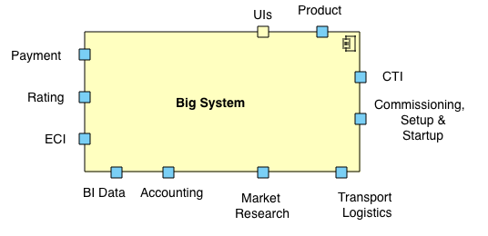
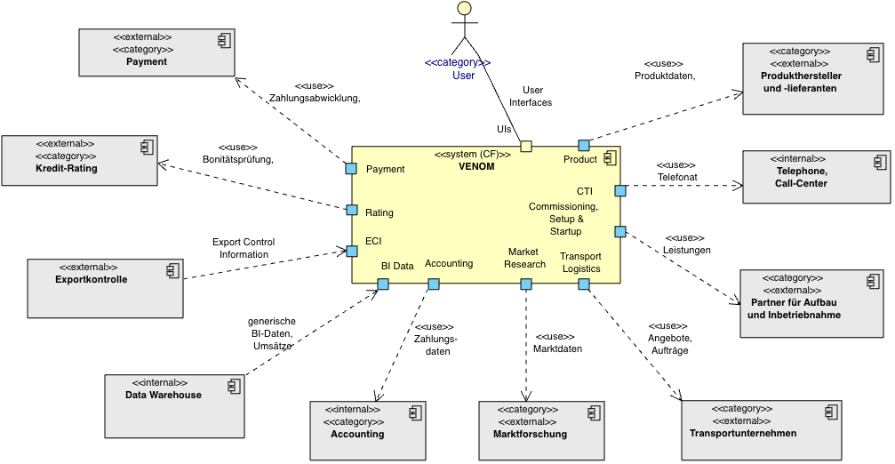

If your system interacts with many external systems, you could use UML port symbols
at to denote categories (or clusters) of such neighbours,
instead of showing all external systems as separate symbols.

That looks similar to [tip 3-7 (categories of external systems)](/tips/3-7),
but doesn't require the use of stereotypes and might save some drawing effort.

Ports have the great advantage that they connect inside and outside:
You can depict which internal blackbox communicates with which of the external
neighbours.

See the examples below: First you see a context with ports, below you find the more extensive version with ports and explicit neighbour systems.

