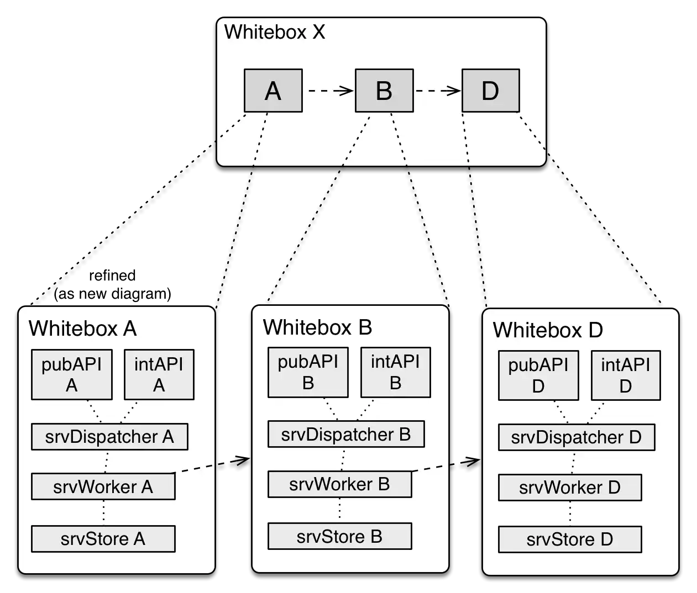
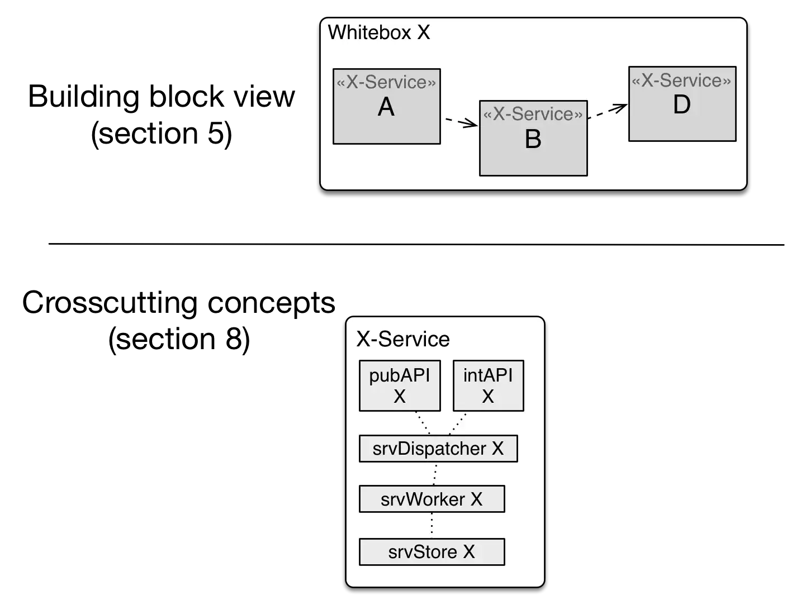

In short: instead of repeating recurring building-block substructures,
factor those out into a crosscutting concepts.

## Troublesome redundancy
See the following building block diagrams: The top-level (whitebox X)
consists of blackboxes A, B and D - which are refined in three diagrams.

All those refinements look strikingly similar - that's too much
redundancy.

{:width="85%"}

## Crosscutting Concepts to the rescue

A somewhat leaner approach, based upon crosscutting concepts, avoids
this redundancy. In the following diagram, the whitebox contains
blackboxes A, B and D - but there's no refinement for those. Instead,
they all carry the stereotype «X-service», refering to a crosscutting
concept that explains how elements of type X-service» shall be constructed,
build or implemented.

{:width="85%"}

>Crosscutting concepts might describe principles, rules or implementation
restrictions that must hold for specific kinds of building blocks. See
[section 8](/section-8/) for details.

## Related tips

* Explain concepts instead of too many building block details, see [tip 5-28](/tips/5-28).
* You should name important concepts, and use these names in building blocks, see [tip 8-11](/tips/8-11).
