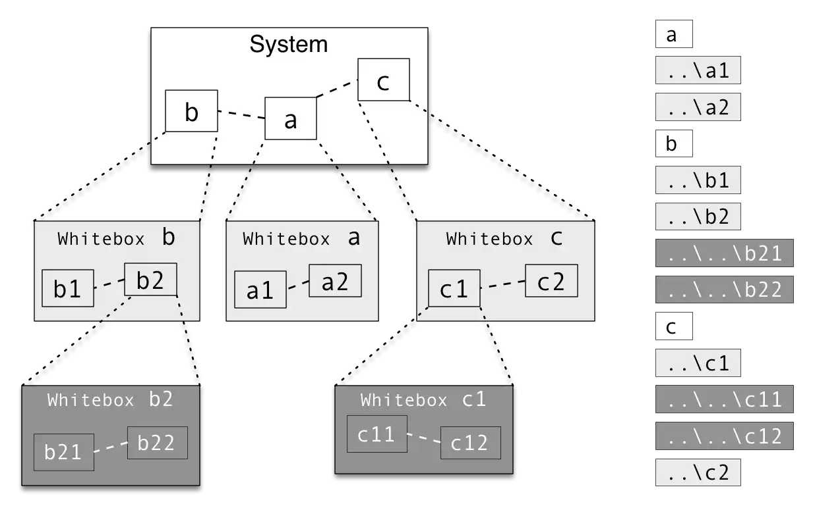

You'll get the simplest mapping between source code to building blocks
if directories within your (source) file system corresponds directly
to your building blocks.

Consider the following example: On its left you find a hierarchy of building
blocks (`a`,`b`,`c` refined into level 1, `b2` and `c1` refined in level 2).
On the right hand side you see a snapshot of the corresponding file system,
with (higher-level) directories `a`,`b` and `c` and corresponding
subdirectories.

{:width="85%"}
