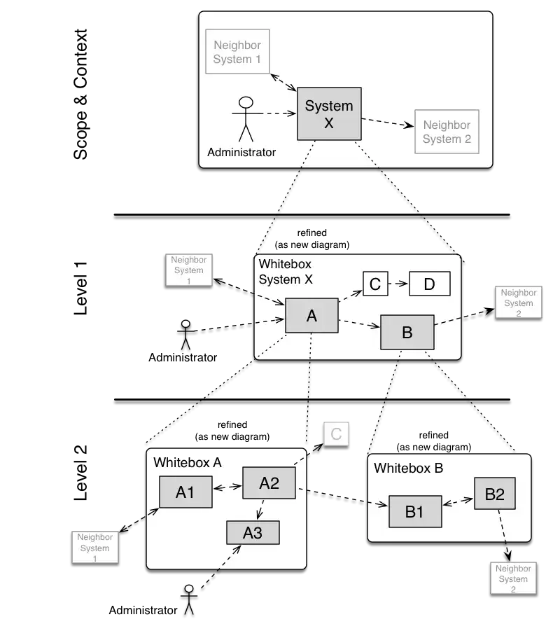

Explain the structure of your source code as a hierarchy of white- and blackboxes,
starting from the context view (arc42 section 3).

The context shows the complete system as a blackbox, which the building block
view level-1 refines as whitebox.

The diagram below schematically shows this hierarchy:

* **Level 1** is the white box description of the overall system together with black box descriptions of all contained building blocks.
* **Level 2** zooms into some building blocks of level 1.
Thus it contains the white box description of selected building blocks of level 1, together with black box descriptions of their internal building blocks.
* **Level 3** zooms into selected building blocks of level 2, and so on.

> In the diagram above, each **rounded rectangle** represents a single whitebox,
which shall be documented by an instance of the whitebox template.
You will not have the hierarchy in a single diagram in your concrete documentation!
