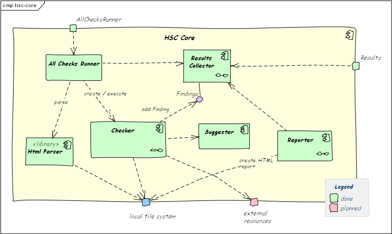

In case you include third-party elements in your building block view,
explicitly distinguish them from the elements specific to your system.

You have several options:

* by stereotypes, which is common within UML models
* by color or other layout options
* by naming conventions

In the diagram below, you find an example for the first option (stereotype).

{:width="85%"}

## See also

* [tip 5-19 (if needed, include third-party elements)](/tips/5-19)
