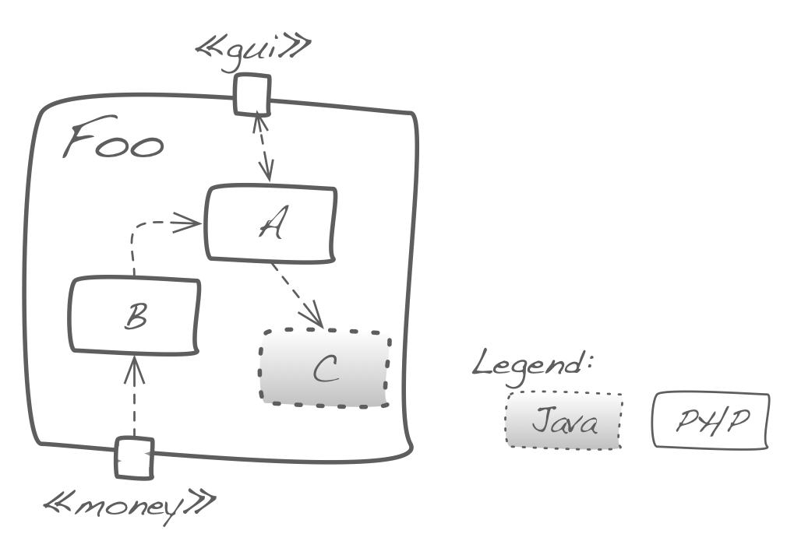

You can amend the high abstraction level of building-block level-1
by additional information, like:

* programming languages used in the specific building block
* version control information (i.e. which vc system used)
* organizational information (team setting, completion or planning status)

You can use color, shading, grouping or other graphical
means, or denote such issues via stereotypes.

In case you do that, please explain these kinds of information
in a legend or textual explanation.

See the following example:

{:width="65%"}

## Think twice before adding information

You can extend this tip to further layers of the building block view. But keep the fundamental rule of economical documentation
in mind: _Additional_ information might be relevant for only a brief
period of time - so you might better refrain from including it in the
documentation.

Eventuell ist diese „sons- tige“ Information nur für kurze Zeit interessant – also lassen Sie das im Zweifel lieber weg.
