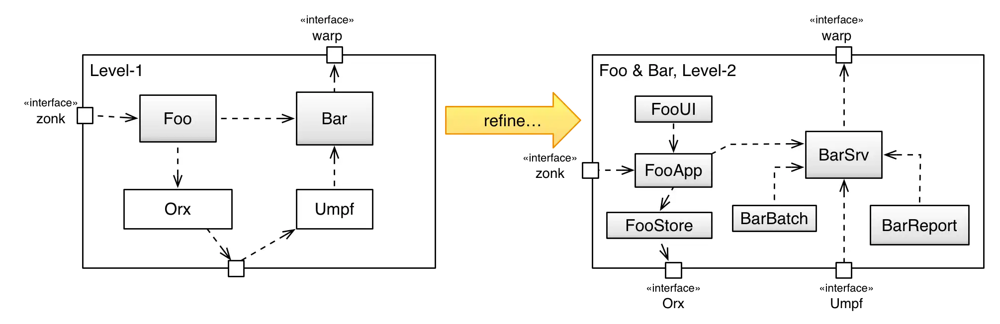
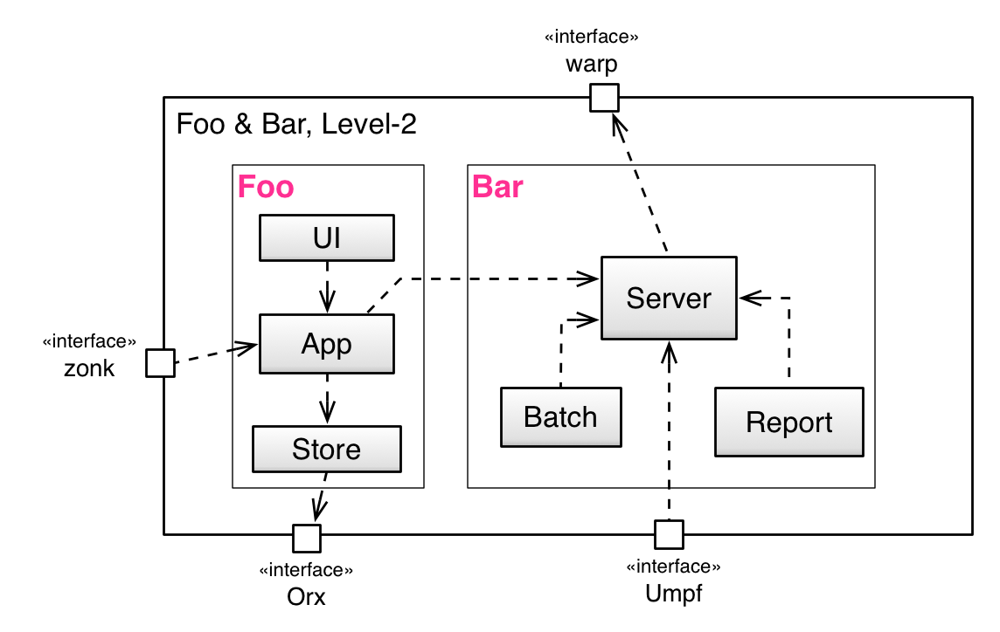

In case you mutually refine several building blocks at once
(as proposed in [tip 5-25 (mutually refine)](/tips/5-25)),
you should explicitly document the _origin_ (aka ancestor or root)
of the refined building blocks.

It should be explicit for every element within a _refined_ whitebox
where it's originating (that means, where it is refined from).

You find two examples below:

#### Document origin by naming convention

{:width="85%"}

#### Document origin by graphical means

In the next diagram the origin of the refined building blocks
is shown by a named rectangle around the refined blocks
(for illustration purposes shown in pink color...)

{:width="85%"}
