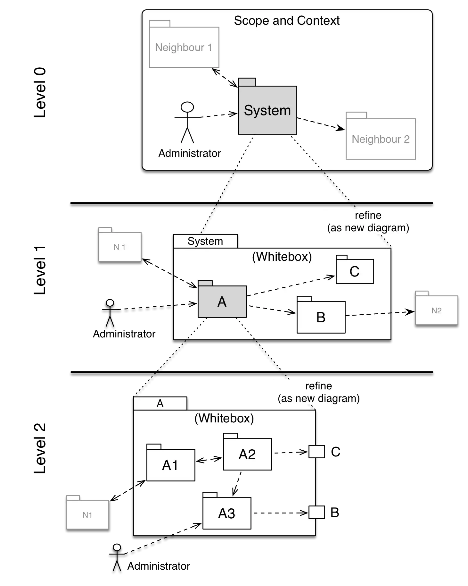

The whitebox diagrams within the building block view
form a tree structure with the context diagram as root of
this hierarchy.

This tree should be **partial**, you should refine only
some of the building blocks.

The following diagram shows such a partial tree: The overall system
is refined on level-1 into building blocks `A`, `B` and `C`.

Only `A` is then refined and detailled in level-2.

{:width="85%"}
