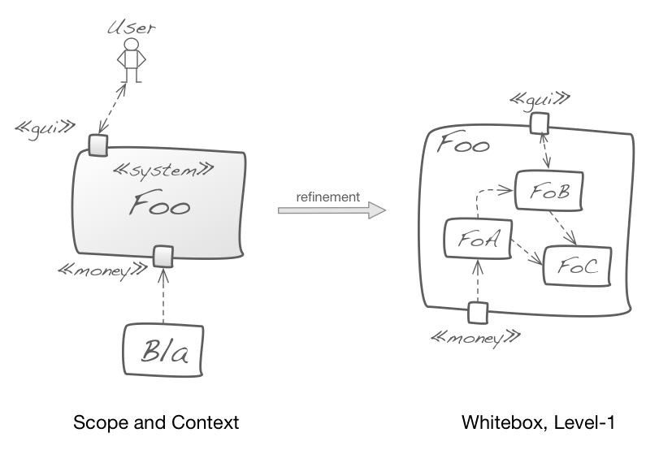

Ensure that level-1 is always consistent (with respect to external interfaces)
to the systems' scope and context ([arc42 section 3](/section-3)).

The following diagram shows an example of such a consistent refinement from
context to building block level 1.

{:width="85%"}
