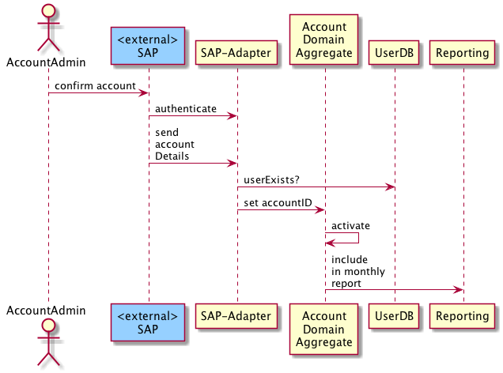
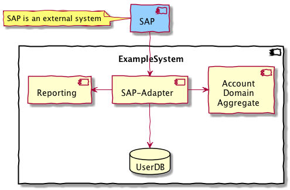

A 'schematic' overview of a certain process, activity or function is often
sufficient to understand the interaction between different building blocks
of the system.

Especially developers tend to look for details in source code anyhow, so
they don't need very detailed diagrams.

In 'schematic' scenarios you refer to higher levels of abstraction, to
building blocks from higher levels (e.g. level-1) of the building block view.

In the following scenario only building-blocks from level-1 of the
corresponding building block view interact.

#### Building Block Level-1 for the Example:

