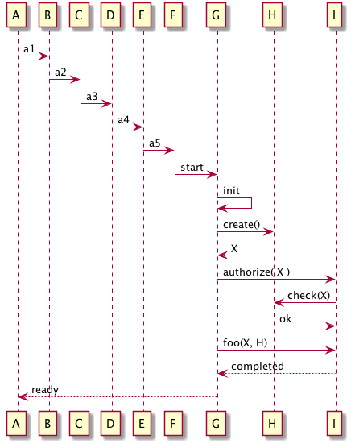
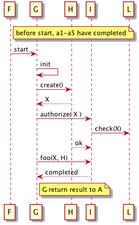

We have seen too many sequence diagrams resembling the one below: Scenarios that
just propagate date over several participants - usually non-interesting stuff.


{:width="40%"}


## More effective: Partial scenarios

Describe only excerpts or parts of such scenarios.

* Focus on risky, difficult, complicated or interesting parts.
* Don't hesitate to start right in the middle of a longer (overall) process
* Cut out boring, standard, simple of straightforward stuff

Compare the (compact) diagram below with the (boring and much longer) version above.


{:width="30%"}


Btw: both diagrams were generated from a PlantUML textual description, the code for
the latter is given below:

```PlantUML
@startuml
note right of F: before start, a1-a5 have completed
F -> G : start
G -> G : init
G -> H : create()
G <--H : X
G -> I : authorize( X )
I -> L : check(X)
I <--H : ok
G -> I : foo(X, H)
I --> G : completed
note right of G: G return result to A

@enduml
```
