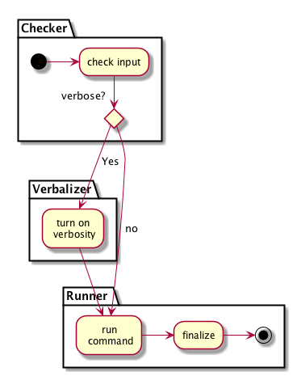

Take a look at the following example - which shows the _modularization_ or _partitioning_
of an activity diagram.

{:width="40%"}

The diagram above was rendered by PlantUML with the following code:

```PlantUML
@startuml
partition Checker {
  (*)  -> "check input"
    -->If "verbose?" then
  }

  partition Verbalizer {
     -> [Yes] "turn on\n verbosity"
  }

  partition Runner 
   --> "run\n command"


   else
     ->  [no] "run\n command"
     -> "finalize"
   Endif
     ->(*)

@enduml
```
