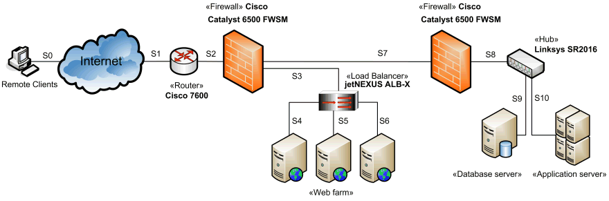

Describe the technical infrastructure (aka the underlying hardware) the
system is running in. That shall include:

* nodes, i.e. processors, server, cluster... and their
* relations (channels), i.e. bus, network or wireless connections,
* additional hardware elements, i.e. firewall, router, switches, storage etc.

You could either use UML deployment diagrams or free-form graphics, like shown below:

(diagram by <a target="_blank" rel="noopener noreferrer nofollow" href="https://www.uml-diagrams.org/examples/web-application-network-diagram-example.html?context=depl-examples">UML-diagrams.org</a>)

In case your stakeholder like such graphical icons or symbols: use a consistent
set of such symbols with a _defined_ semantic!

### Delegate hardware documentation

Try to delegate the hardware and infrastructure documentation to the appropriate
stakeholders.
