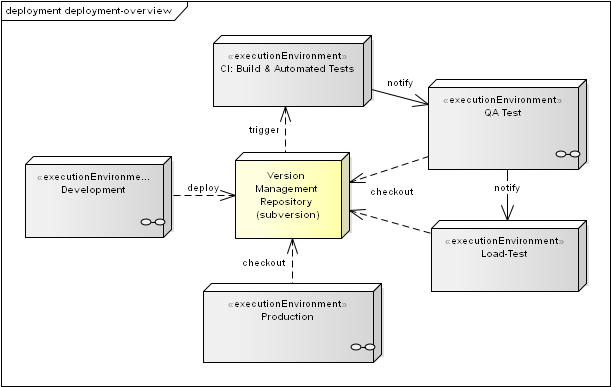

In case the system is developed, tested and operated in different hardware
environments (i.e. DEV for development, CI for build/integration,
  TEST for system and manual tests and PROD for production), you should
  document these environments plus possible differences between them.

The stereotype &laquo;executionEnvironment&raquo; symbolizes such environments.
The little "infinity" symbol in the lower right corner (i.e. in Development)
means there is a refined diagram available (that "infinity" symbol is a speciality
of Sparx EnterpriseArchitect&reg;).

