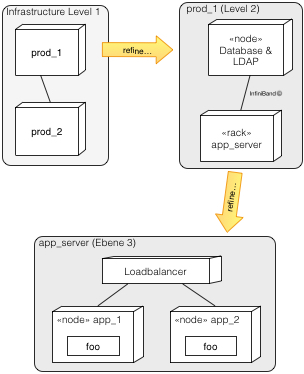

Like in the building block view (see [tip 5-2 (hierarchical building block view)](/tips/5-2))
you can organize and document the deployment view as a hierarchy. That can be especially useful
in heterogeneous or distributed systems.

The diagram below gives an example:

