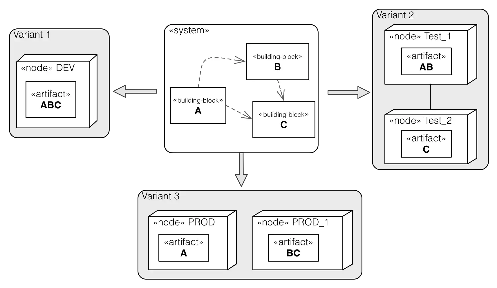

In case your system requires different nodes or processors to execute, you should explain
the mapping of your building blocks to that hardware.

Document or specify the mapping of the building blocks (see arc42 section 5)
onto the hardware (more specifically - the mapping of the _artifacts_ generated/compiled/created
  from the actual source code building blocks.). That is called _deployment_.  
In many cases that can be an m:n mapping, with several variants of deployment artifacts

Remember to explain these deployment variants.

In the following diagram you find three different variants how the
three architecture building blocks `A`, `B` and `C` can be deployed on
different hardware environments.

